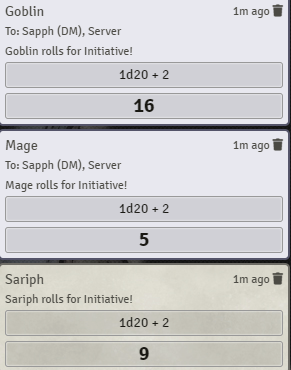
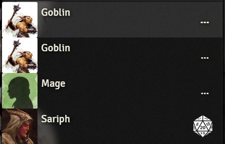
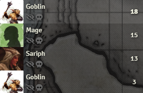

# Foundry VTT Hidden Initiative

"Hidden Initiative" is a [Foundry VTT](https://foundryvtt.com/) module that makes some changes to how initiative is rolled.

The goal of this module is to allow:

-   Defaulting to "GM" visibility for initiative rolls
-   Hiding the visibility of raw initiative values from your players

Vanilla Foundry VTT will roll initiative for monsters (and players) in public, and then show the initiative scores in the Combat Tracker.

If you prefer more suspenseful combat, Hidden Initiative allows you to:

1. Show a placeholder "?" when you first roll monster initiative
2. Leave the final initiative order ambiguous until a full round has completed

You, the DM, will see the exact initiative at all times. Your players will be uncertain of who has the next turn until you press that "Next turn" button, at which point the next monster (or player) will slot into position on their screens.

Once a full round of combat has finished, the initiative order is considered public knowledge and won't re-sort itself any longer.

## Installation

Load the following manifest into Foundry: https://raw.githubusercontent.com/sfuqua/fvtt-hidden-initiative/master/module.json

## Configure roll visibility for players and NPCs

Set your monsters and players with distinct visibility if you like:

When doing group rolls, each roll has the chosen setting applied:

## Keep initiative a mystery until combat is underway

Players can see which monsters haven't rolled yet (...):

Once a roll is finished, the value changes to "?". As a DM you see the proper list, but all your players know is that the monster is ready for battle:

As combat progresses and the turn order is revealed to your players, the initiative values get replaced with a "-" to indicate the monster is locked into its correct position, without giving away the actual roll value:

### DM view

### Player view

Here, the mage is actually next up in the turn order, but Sariph doesn't know that yet.

When the DM presses next turn and announces it's the mage's turn, Sariph will see the mage jump ahead of him in the queue and the "?" will get replaced with a "-" (dependent on module settings).

_Note_: This screenshot is with the "Reveal initiative numbers during combat" setting **unchecked**. If it were checked, the goblin's initiative of 18 would be visible to players after it took its turn.

After that will be Sariph's turn, followed by the final goblin. On subsequent rounds, the combat order will be known for everyone.

## Notes on compatibility

This section documents how the module works at a high level, to shed light on compatibility risks with other modules.

### Tampering with CombatTracker.getData

This module mixes some functionality into `CONFIG.ui.combat` with a custom class (using `WithHiddenInitiative`) in order to customize the data that is provided to the CombatTracker UI. Specifically, it provides a custom implementation of `CombatTracker.getData`, which first gets data from the base class and then tampers with it (overwriting initiative values and re-sorting).

As a result:

-   This module _may_ have compatibility problems with modules that overwrite `CONFIG.ui.combat`; if this module loads first, its functionality may be overwritten by other modules. If other modules load first, this module _should_ extend their functionality.

### Override of Combat.rollInitiative

In order to customize the chat visibility of initiative rolls, this module overwrites the `rollInitiative` function of each Combat instance in the CombatTracker (this happens in the `"renderHiddenInitiativeCombatTracker"` hook). However, the original value is saved off in a closure and then called in order to the "heavy lifting" of the dice roll; the shim just customizes the `rollMode`.

As a result, this module may not play nicely with other modules that interfere with the behavior of the `Combat.rollInitiative` function. However, if a module just _calls_ `rollInitiative`, it _should_ continue to work as expected.
